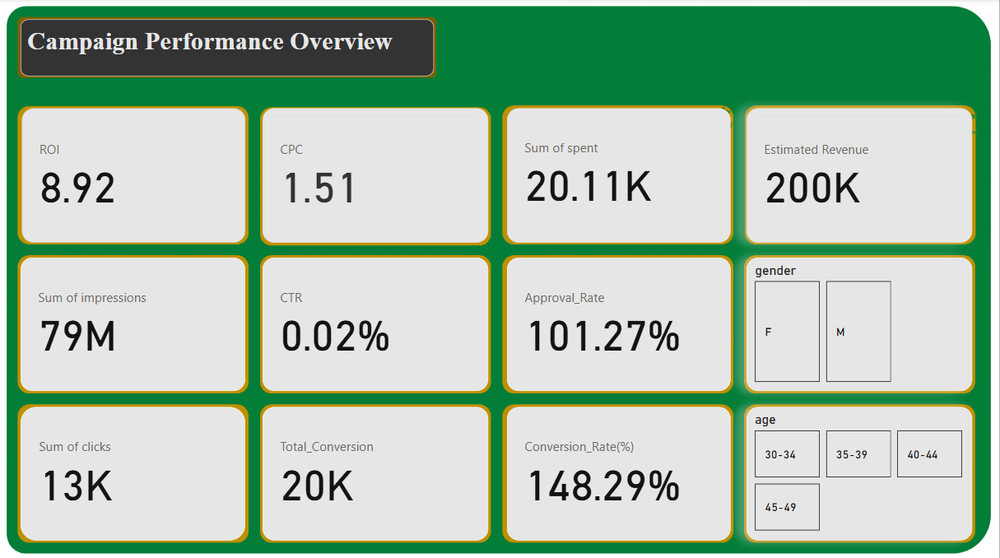
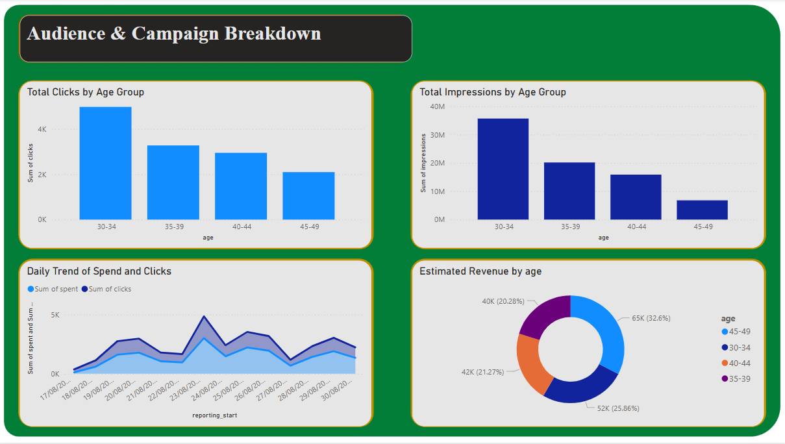
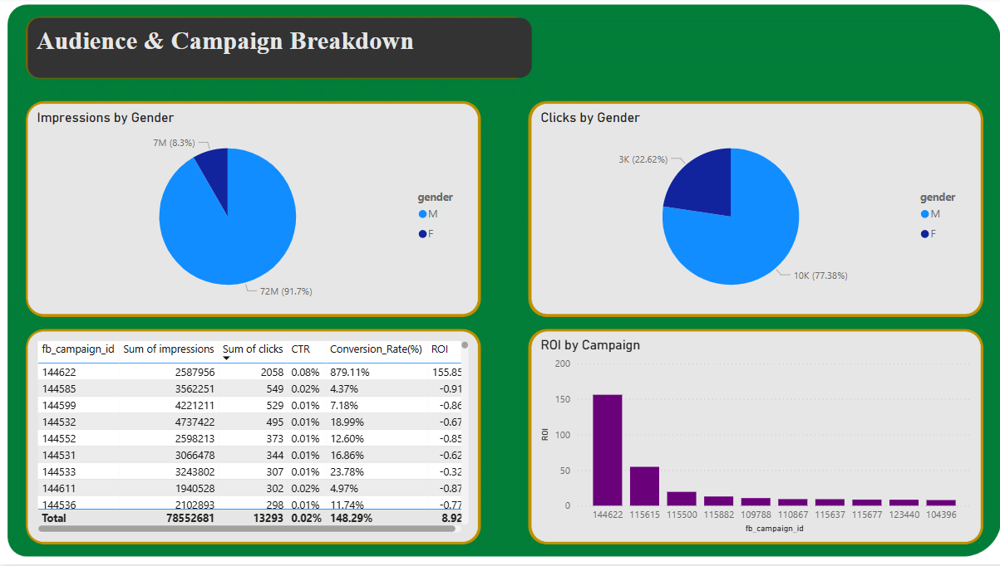

# FUTURE_DS_02
# 📊 Facebook Ads Performance Dashboard (Power BI)

## 📝 Project Summary
This project is Task 2 of my Future Interns internship, where I analyzed **Facebook Ad Campaign Performance** using **Power BI**. The dataset included ad-level details like impressions, clicks, conversions, spend, revenue, and audience demographics.

The objective was to create an **interactive dashboard** that would help decision-makers understand campaign effectiveness and guide marketing strategy.

---

## 🎯 Objectives
- Track key performance indicators (KPIs) such as CTR, CPC, ROI, and conversions.
- Identify top-performing campaigns and audience segments.
- Provide actionable insights and recommendations.
- Build a professional dashboard using Power BI visuals and filters.

---

## 📁 Data Source
The data was provided in Excel format and included:
- `campaign_id`, `ad_id`
- `clicks`, `impressions`, `CPC`, `Estimated Revenue`, `Spent`
- `Conversion Rate`, `Approval Rate`, `ROI`
- Demographics: `age`, `gender`
- Date: `reporting_start`

---

## 📈 Page 1 – Campaign Performance Overview

### 💡 Visuals (KPIs):
- **Total Clicks**: 13K
- **Impressions**: 79M
- **CTR**: 0.02%
- **CPC**: 1.51
- **ROI**: 8.92
- **Conversion Rate**: 148.29%
- **Approval Rate**: 101.27%
- **Estimated Revenue**: 200K
- **Total Spend**: 20.11K
- **Total Conversions**: 20K

### 🔎 Filters:
- Slicers for **Gender** and **Age** allow user interaction.

### 📌 Purpose:
Provides a high-level summary of Facebook ad performance to quickly gauge effectiveness.

---

## 📉 Page 2 – Audience & Campaign Breakdown

### 📊 Visualizations:
- Bar Chart: **Clicks by Age Group**
- Bar Chart: **Impressions by Age Group**
- Pie Charts: **Impressions and Clicks by Gender**
- Line Chart: **Spend vs Clicks Over Time**
- Bar Chart: **ROI by Campaign ID**
- Table: **Campaign-level metrics** (CTR, ROI, Conversion Rate, etc.)

### 📌 Purpose:
Detailed exploration of performance by demographic segments and campaign ID.

---

## 📍 Insights

- 👥 **Top Age Group**: The 30–34 age group had the highest clicks and impressions.
- 👩 **Top Gender**: Females accounted for 77% of clicks and 91.7% of impressions.
- 💰 **High ROI Campaigns**: Some campaigns exceeded 100+ ROI, showing strong returns.
- 📉 **CTR is very low** (0.02%), suggesting the need to improve ad content or targeting.
- 🚀 **Conversion Rate over 100%** may indicate repeated conversions or data quirks.
- 📆 **Spend Peaks**: Spending peaked mid-campaign, followed by click increases.

---

## ✅ Recommendations

1. Focus more budget on **30–34 age group** and **female users**.
2. Improve **ad creatives** to increase the low CTR.
3. Prioritize **campaigns with high ROI** for budget optimization.
4. Review calculation of **conversion rate** and **approval rate** for data accuracy.
5. Use time-based trends to schedule **ads during high-response periods**.

---

## 🧰 Tools Used
- **Power BI** for dashboard and visuals
- **Excel** for raw data cleaning
- **DAX** for calculated metrics:
  - `CTR = Clicks / Impressions`
  - `Conversion Rate = Total Conversions / Clicks`
  - `Approval Rate = Approved Conversions / Total Conversions`
  - `ROI = (Revenue - Spend) / Spend`

---

## 🖼️ Dashboard Preview
### Page 1: Campaign Performance Overview

### Page 2 & 3: Audience & Campaign Breakdown

---

## 📌 Conclusion
This project gave me hands-on experience in **business analytics**, **data storytelling**, and the use of **Power BI** for marketing intelligence. The dashboard highlights both opportunities and areas for improvement in Facebook ad campaigns.

---

## 🔗 Repository Info
Feel free to explore the dashboard visuals, report pages, and code used for calculated columns in Power BI.

---
